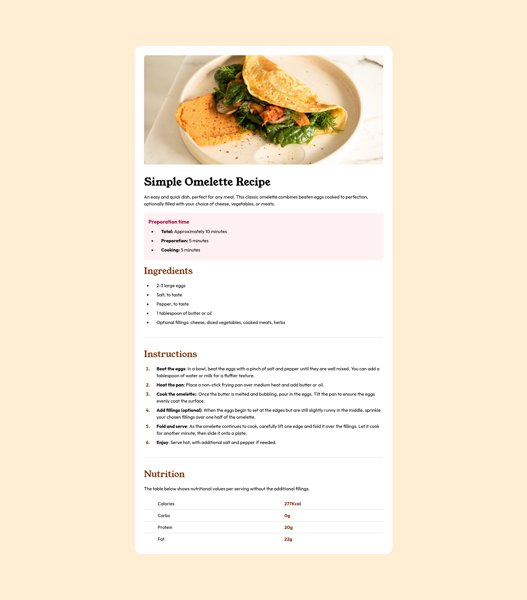

# Frontend Mentor - Recipe page solution

This is a solution to the [Recipe page challenge on Frontend Mentor](https://www.frontendmentor.io/challenges/recipe-page-KiTsR8QQKm).

## Table of contents

- [Overview](#overview)
  - [The challenge](#the-challenge)
  - [Screenshot](#screenshot)
  - [Links](#links)
- [My process](#my-process)
  - [Built with](#built-with)

## Overview

This project implements a simple recipe page using HTML and tailwind-css

### Screenshot

### Links

- Solution URL: [Add solution URL here](https://github.com/JVarney03/webdev-recipe-page)
- Live Site URL: [Add live site URL here](https://jvarney03.github.io/webdev-recipe-page/)

### Built with

- Semantic HTML5 markup
- CSS custom properties
- [Tailwind](https://tailwindcss.com)
- [Vite](https://vite.dev)
